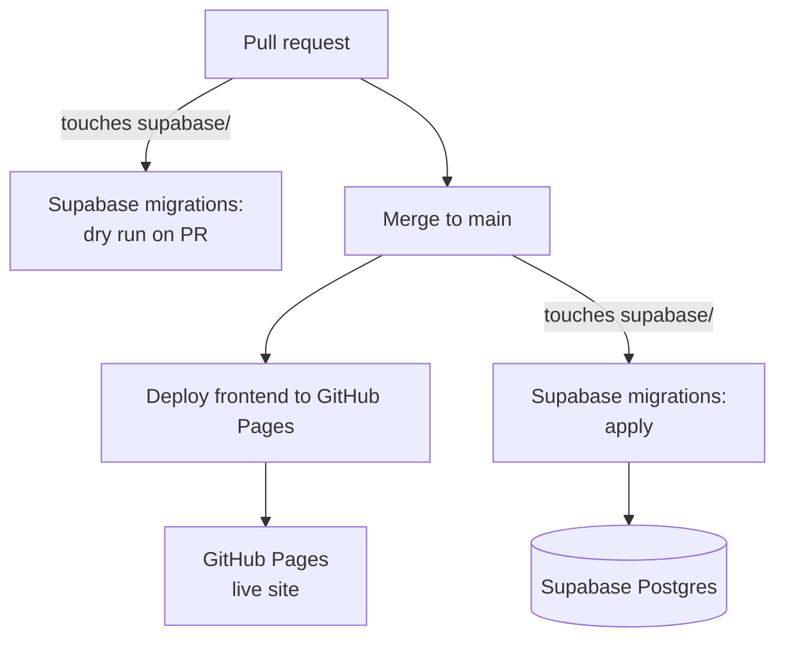
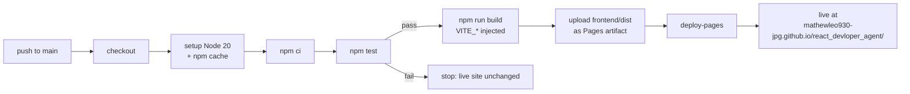
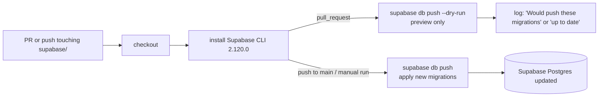

# Deployment

The app has two deployments, each handled by its own GitHub Actions workflow:

| | Frontend deployment | Database deployment |
|---|---|---|
| What | React app → GitHub Pages | SQL schema changes → Supabase Postgres |
| Workflow | `.github/workflows/deploy-pages.yml` | `.github/workflows/supabase-migrations.yml` |
| Name in the Actions tab | **Deploy frontend to GitHub Pages** | **Supabase migrations** |
| Triggered by | every push to `main`; manual run | PRs and pushes to `main` touching `supabase/**` or the workflow file; manual run |
| On a pull request | does not run | **dry run**: lists what would be applied, changes nothing |
| Needs | Variables `VITE_SUPABASE_URL`, `VITE_SUPABASE_PUBLISHABLE_KEY` | Secret `SUPABASE_DB_URL` |

For how the app works at runtime, see [HOW-IT-WORKS.md](HOW-IT-WORKS.md).



The two are kept separate on purpose:
- A frontend change doesn't touch the database, and a failing frontend test can't block a database change.
- Only the migration workflow can see the database credentials. The frontend workflow only gets public
  values.

---

## 1. Frontend deployment (GitHub Pages)

### Flow



### Logic, step by step

The workflow has two jobs. **build** must succeed before **deploy** starts.

| Job | Step | What it does and why |
|---|---|---|
| build | `actions/checkout` | Gets the code at the merged commit |
| build | `actions/setup-node` (Node 20) | Installs Node and caches npm downloads, keyed on `frontend/package-lock.json` |
| build | `npm ci` | Clean install of the exact versions in `package-lock.json` |
| build | `npm test` | Runs all Vitest tests. **If any fail, the job stops and nothing is deployed.** |
| build | `npm run build` | Vite builds into `frontend/dist`. The two `VITE_*` repo variables are injected here and baked into the JS. |
| build | `actions/upload-pages-artifact` | Packages `frontend/dist` for Pages |
| deploy | `actions/deploy-pages` | Publishes the package. The site updates within about a minute. |

Settings in the workflow:
- `permissions: pages: write, id-token: write` lets the job publish to Pages without a personal token.
- `concurrency: pages` with `cancel-in-progress: true`: if you merge twice quickly, the older build is
  cancelled and only the newest one deploys.

### Build settings that exist because of GitHub Pages

- `vite.config.js` sets `base: '/react_devloper_agent/'` for builds, because Pages serves the site from
  that sub-path. **If the repo is renamed, update this.**
- The app uses `HashRouter`, so refreshing any page works without a server-side redirect.

### One-time setup (already done)

- Settings → Pages → Source: **GitHub Actions**
- Settings → Secrets and variables → Actions → **Variables**: `VITE_SUPABASE_URL`,
  `VITE_SUPABASE_PUBLISHABLE_KEY`

### Redeploying without a code change

Actions → **Deploy frontend to GitHub Pages** → **Run workflow**. Do this after changing a `VITE_*`
variable, because the values only take effect at build time.

---

## 2. Database deployment (Supabase migrations)

### Flow



### Logic, step by step

| Step | What it does and why |
|---|---|
| `actions/checkout` | Gets `supabase/migrations/*.sql` |
| `supabase/setup-cli` | Installs a pinned CLI version (2.120.0), so behaviour doesn't change unexpectedly |
| **Preview migrations** (PRs only) | `supabase db push --db-url … --dry-run` lists which files would run, without changing anything. Review this before merging. |
| **Apply migrations** (`main` / manual) | `supabase db push --db-url …` runs the new files against the live database |

### How `db push` decides what to run

1. Supabase keeps a history table, `supabase_migrations.schema_migrations`, with the version (the
   timestamp prefix) of every migration already applied.
2. `db push` compares the files in `supabase/migrations/` with that table.
3. It runs **only the files not in the table yet**, oldest first, and records each one. Every migration
   runs exactly once.

The first migration (`20261009000000_create_tasks.sql`) was run by hand in the SQL Editor, so it was
marked as applied once with:
```powershell
npx supabase migration repair --status applied 20261009000000 --db-url "<session pooler string>"
```

Settings in the workflow:
- It connects straight to Postgres with `--db-url`, so it needs no Supabase account token and no
  `supabase link`.
- `concurrency: supabase-migrations` with `cancel-in-progress: false`: runs queue up instead of
  overlapping, and a migration is never cancelled halfway.

### The `SUPABASE_DB_URL` secret

- It must be the **Session pooler** string from Supabase → **Connect**:
  `postgresql://postgres.zltgrvhonhjznzkrogdp:<PASSWORD>@aws-…pooler.supabase.com:5432/postgres`
- Not the "Direct connection" string (`db.<ref>.supabase.co`). That one only works over IPv6 and fails on
  GitHub runners.
- URL-encode special characters in the password (`@` becomes `%40`), or use a letters-and-numbers password.
- After resetting the database password (Project Settings → Database), update this secret.

---

## 3. Shipping changes

### Frontend-only change

```powershell
git checkout main; git pull
git checkout -b feature/<name>
# edit frontend/src, then from frontend/: npm test; npm run dev
git push -u origin feature/<name>    # open a PR, then merge
```
On merge, the frontend deployment runs. The migration workflow does not.

### Database change (for example, adding a column)

```powershell
git checkout main; git pull
git checkout -b feature/add-due-date
npx supabase migration new add_due_date_to_tasks
# write SQL in supabase/migrations/<timestamp>_add_due_date_to_tasks.sql, for example:
#   alter table public.tasks add column due_date date;
git push -u origin feature/add-due-date    # open a PR
```
1. On the PR, check the **Supabase migrations** dry run lists your file.
2. Merge. The migration is applied. Confirm it in Supabase → Table Editor → `tasks`.
3. Update the frontend to use the column, in the same PR or a later one.

### Rules for migrations

- **Never edit a migration that has already been applied.** Add a new file, even to fix a mistake.
- **Don't change the schema by hand** in the SQL Editor or Table Editor; the database would drift from
  the files. Read-only `select` queries are fine.
- New columns should be **nullable or have a default**, for example
  `add column priority int not null default 0`.
- Be careful with `drop` and renames: they delete data or break the live site. Read the dry run first.
- If one PR changes both the schema and the frontend, both workflows run in parallel on merge. The site
  may show errors for a few seconds until the migration finishes. Adding the column in an earlier PR
  avoids this.

---

## 4. Checking a deployment

| Question | Where to look |
|---|---|
| Did the site deploy? | Actions → **Deploy frontend to GitHub Pages** → latest run on `main` is green |
| Did the database change apply? | Actions → **Supabase migrations** → latest run on `main`, step **Apply migrations** |
| Which migrations are applied? | `npx supabase migration list --db-url "<session pooler string>"` (Local and Remote columns should match) |
| Is the data there? | Supabase → Table Editor → `tasks` |

Both workflows can run from the same merge with almost identical run IDs. Check the **workflow name** in
the Actions sidebar, not only the run number.

---

## 5. Troubleshooting

| Workflow | Error | Cause | Fix |
|---|---|---|---|
| Frontend | fails at `npm test` | A broken test | Run `npm test` locally and fix it. The live site keeps the previous version. |
| Frontend | site loads but shows an error / no tasks | `VITE_*` variables missing or wrong | Fix the repo Variables, then **Run workflow** |
| Frontend | blank page | `base` in `vite.config.js` doesn't match the repo name | Set `base: '/<repo-name>/'` |
| Frontend | deploy step fails with a Pages error | Pages source isn't set to GitHub Actions | Settings → Pages → Source: GitHub Actions |
| Migrations | `password authentication failed` | Wrong password in `SUPABASE_DB_URL`, or not URL-encoded | Update the secret |
| Migrations | `hostname resolving error` / timeout | The Direct connection string was used | Use the Session pooler string |
| Migrations | `… already exists` | That change was already made by hand | `supabase migration repair --status applied <version> --db-url …` |
| Migrations | SQL error in Apply step | Bad SQL in the new migration | The failed file is not recorded as applied, so fix that file in a new PR and merge again. (Files that did apply must never be edited.) |
