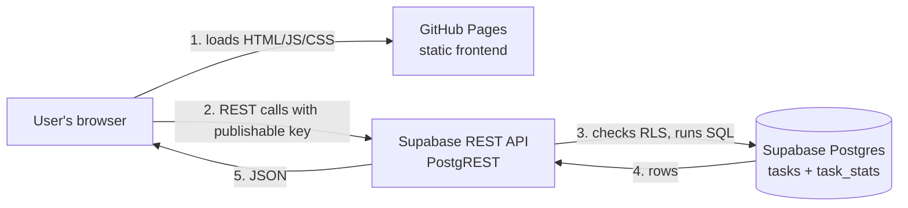
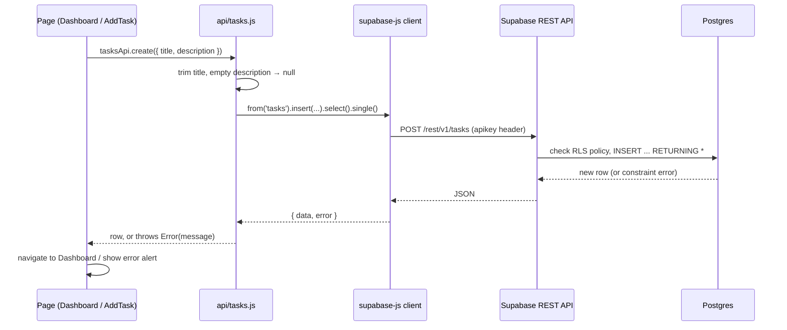

# How the Task Manager works

This document explains how the frontend and backend fit together while the app runs. For how code gets
built and deployed, see [DEPLOYMENT.md](DEPLOYMENT.md).

- **Live site:** https://mathewleo930-jpg.github.io/react_devloper_agent/
- **Supabase project ref:** `zltgrvhonhjznzkrogdp`

---

## 1. The big picture

There is **no server of our own**. The frontend is a set of static files on GitHub Pages. The browser
talks directly to Supabase, which provides the database and an automatic REST API.



| Piece | Technology | Runs on | In the repo |
|---|---|---|---|
| Frontend | React 18, Vite, React Router, supabase-js | GitHub Pages (static files) | `frontend/` |
| Backend API | Supabase's automatic REST API (PostgREST) | Supabase | nothing to write; generated from the schema |
| Database | Postgres | Supabase | `supabase/migrations/*.sql` |

---

## 2. Frontend

### Structure

```
frontend/
  index.html                  # page shell; sets light/dark theme before React loads
  vite.config.js              # base path for GitHub Pages, dev server, test config
  .env.example                # template for env vars (committed)
  .env.local                  # your real values (gitignored)
  src/
    main.jsx                  # entry point; wraps the app in HashRouter
    App.jsx                   # top bar + routes
    lib/supabase.js           # creates the Supabase client from env vars
    api/tasks.js              # every database call the app makes
    pages/Dashboard.jsx       # page 1: stats + recent tasks + complete/delete
    pages/AddTask.jsx         # page 2: add-task form
    pages/Analytics.jsx       # page 3: completed / pending / deleted bar chart
    components/               # StatCard, TaskTable, ThemeToggle, BreakdownChart
    breakdown.js              # task_stats row → chart bars with percentages
    hooks/useTheme.js, theme.js   # light/dark theme
```

### Pages and routes

| URL | Page | What it does |
|---|---|---|
| `#/` | Dashboard | Shows total / pending / completed counts and the 20 newest tasks; complete or delete a task |
| `#/analytics` | Analytics | Bar chart, summary sentence and counts for completed, pending and deleted tasks |
| `#/tasks/new` | Add Task | Form with title (required, ≤ 200) and description (optional, ≤ 2000) |
| anything else | redirects to `#/` | |

URLs use `#` because of **HashRouter**: GitHub Pages can only serve real files, so refreshing `/tasks/new`
would give a 404. With `#/tasks/new`, the browser always loads `index.html`, and React reads the route from
the part after `#`.

### Startup

1. The browser loads `index.html`. A small inline script applies the saved or system theme before
   anything is drawn, so dark-mode users don't see a white flash.
2. `main.jsx` mounts `<App />` inside `HashRouter`.
3. `lib/supabase.js` creates one Supabase client from `VITE_SUPABASE_URL` and
   `VITE_SUPABASE_PUBLISHABLE_KEY`. Those values were baked in when the app was built.

---

## 3. Backend: Supabase

### What Supabase provides

- **Postgres database** that holds the `tasks` table and the `task_stats` view.
- **REST API** generated automatically from the schema: every table and view becomes an endpoint under
  `https://zltgrvhonhjznzkrogdp.supabase.co/rest/v1/`.
- **Row Level Security (RLS)**, which decides what each request is allowed to do.

### Schema

```
tasks
  id           bigint, auto-generated, primary key
  title        text, required, 1–200 chars after trimming
  description  text, optional, ≤ 2000 chars
  status       enum task_status: 'pending' | 'completed'   (default 'pending')
  created_at   timestamptz, default now()
  deleted_at   timestamptz, null until the task is deleted

task_stats (view over tasks)
  total, pending, completed   integer counts of tasks that are not deleted
  deleted                     integer count of deleted tasks
```

Deleting is a **soft delete**: it sets `deleted_at` and keeps the row, so the Analytics tab can count
deleted tasks. Every query for tasks filters on `deleted_at is null`, so deleted tasks never show on the
Dashboard and cannot be completed.

Validation lives in the database as `check` constraints, so bad data is rejected even if it bypasses the
form.

### Security

- The **publishable key** (`sb_publishable_…`) ships inside the website's JavaScript. It is designed to be
  public; it only identifies the project.
- The **RLS policies** decide what that key may do. This app has no login, so the policies allow everyone
  to read, add, update and delete. **Anyone who opens the site can change or wipe all tasks.** This is fine
  for a demo, not for real data.
- To lock it down later: add Supabase Auth, add a `user_id` column, and change the policies to
  `using (user_id = auth.uid())` in a new migration.
- The database password and any `secret`/`service_role` key must never be in the frontend.

---

## 4. Request flow: how frontend and backend talk

Every database call goes through `src/api/tasks.js`. Pages never call Supabase directly.



### Every call the app makes

| User action | `tasksApi` function | HTTP request | SQL Supabase runs |
|---|---|---|---|
| Open Dashboard | `list(20)` | `GET /tasks?deleted_at=is.null&order=created_at.desc,id.desc&limit=20` | `select * from tasks where deleted_at is null order by created_at desc, id desc limit 20` |
| Open Dashboard or Analytics | `stats()` | `GET /task_stats` | `select total, pending, completed, deleted from task_stats` |
| Submit Add Task form | `create(...)` | `POST /tasks` | `insert into tasks (title, description) … returning *` |
| Click Complete | `complete(id)` | `PATCH /tasks?id=eq.<id>&deleted_at=is.null` | `update tasks set status='completed' where id=<id> and deleted_at is null returning *` |
| Click Delete | `remove(id)` | `PATCH /tasks?id=eq.<id>&deleted_at=is.null` | `update tasks set deleted_at=<now> where id=<id> and deleted_at is null returning id` |

After any Complete or Delete, the Dashboard re-runs `list` and `stats` so the counts and table stay in
sync. The Analytics page loads `stats` each time it opens and shows a friendly message with a **Retry**
button if the request fails.

### Error handling

- supabase-js does not throw; it returns `{ data, error }`. `api/tasks.js` turns `error` into a thrown
  `Error`, so the pages can use plain `try/catch`.
- If `complete` or `delete` matches no row (missing or already deleted), the result is `"Task <id> not found"`.
- Database constraint errors (for example, a title over 200 characters) come back as the Postgres error
  message and show in the page's red alert box.

---

## 5. Configuration

| Variable | Where | Purpose |
|---|---|---|
| `VITE_SUPABASE_URL` | `frontend/.env.local` locally; GitHub repo **Variables** for builds | Supabase project URL |
| `VITE_SUPABASE_PUBLISHABLE_KEY` | same | Public API key |

- Vite only exposes variables that start with `VITE_` to the browser.
- The values are baked into the JavaScript bundle **at build time**; changing them requires a rebuild.
- If either one is missing, `lib/supabase.js` throws on startup with a message pointing to `.env.example`.

---

## 6. Running locally

```powershell
cd frontend
npm install
copy .env.example .env.local    # then fill in the URL and publishable key
npm run dev                     # http://localhost:5173
npm test                        # Vitest unit tests
```

Local development uses the **same live Supabase database** as the deployed site. There is no separate dev
database, so tasks you add or delete locally appear on the live site too.

To look at the data directly: Supabase dashboard → **Table Editor → tasks**, or in the SQL Editor:
`select * from tasks order by created_at desc;`
